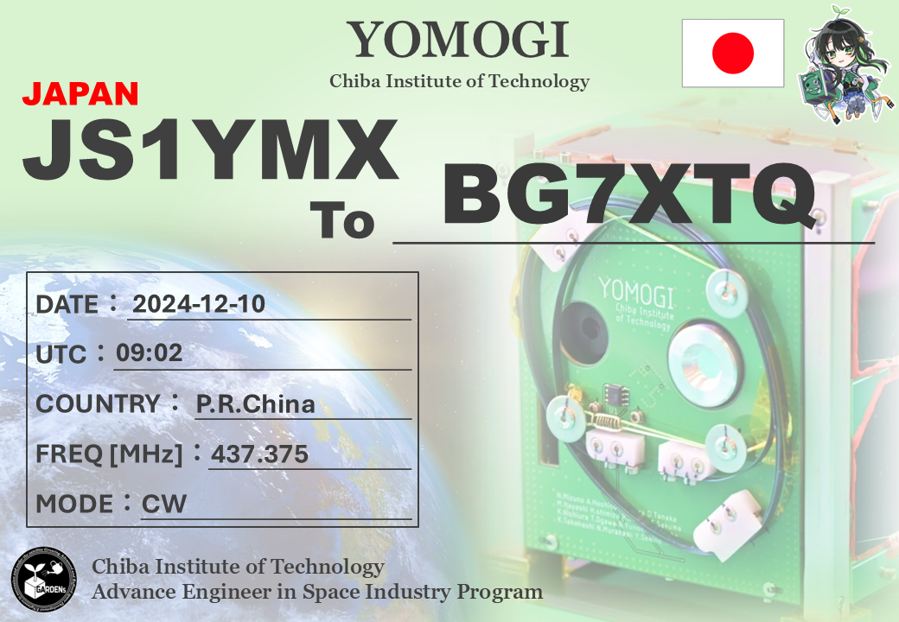
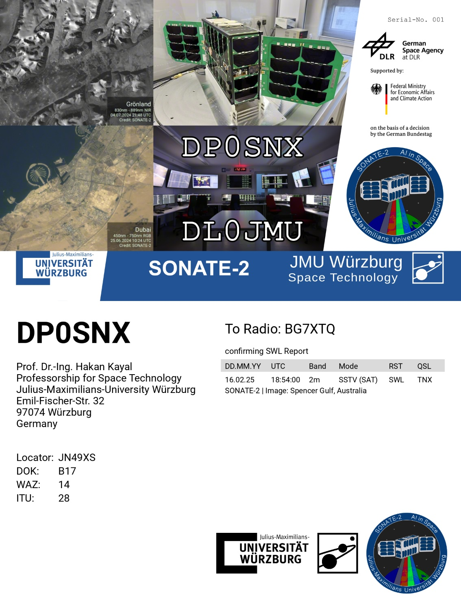
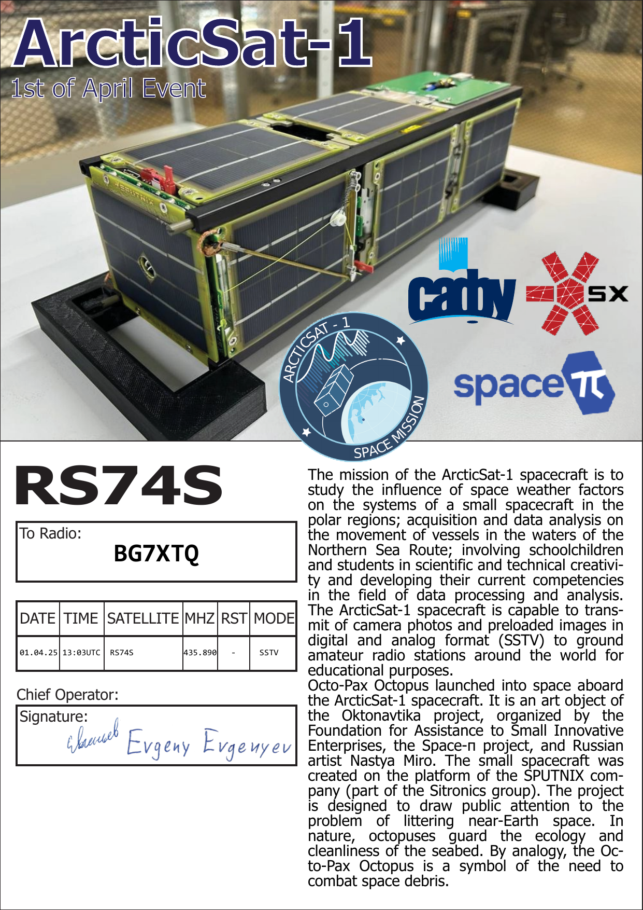

# 我收集的业余无线电 QSL 卡片

**ORBICRAFT-ZORKIY (RS15S) (2023-05-09) - SSTV (digital)**  
  

---

**SAKURA (JS1YNI) (2024-10-08) - CW (digital)**  
  

---

**ISS QSL Card for SSTV reception from RS0ISS (2024-10-13)**  
  

---

**YOMOGI (JS1YMX) (2024-12-10) - CW (digital)**  
  

---

**Hyperview-1G (RS66S) (2025-01-05) - SSTV (digital)**  
  

---

**SONATE-2 (DP0SNX) (2025-02-16) - SSTV (digital)**  
  

---

**PO-101 (2024-11-18) - FM (digital)**  
  

---

**ARCTICSAT-1 (RS74S) (2025-04-01) - SSTV (digital)**  
  

