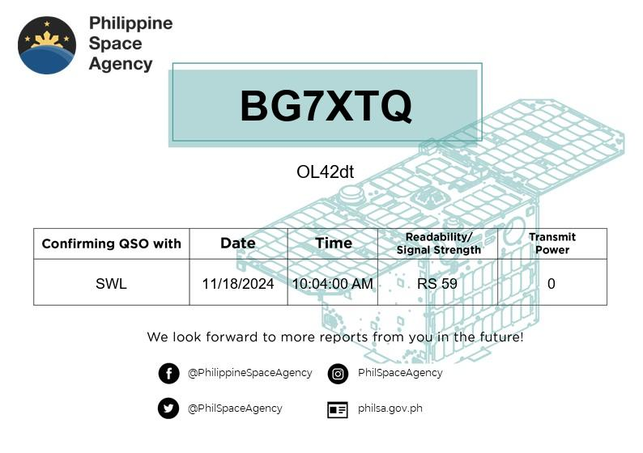

# 我收集的业余无线电 QSL 卡片

**ORBICRAFT-ZORKIY (RS15S) (2023-05-09) - Robot72 SSTV (digital)**  
  

---

**SAKURA (JS1YNI) (2024-10-08) - CW GMSK (digital)**  
  

---

**ISS QSL Card for SSTV reception from RS0ISS (2024-10-13)**  
  

---

**PO-101 (2024-11-18) - FM (digital)**  
  

---

**YOMOGI (JS1YMX) (2025-03-24) - CW (digital)**  
  

---

**HyperView-1G (RS66S) (2025-01-05) - SSTV (digital)**  
  

---

**SONATE-2 (DP0SNX) (2025-04-19) - Martin M1 SSTV (digital)**  
  

---

**ArcticSat-1 (RS74S) (2025-04-01) - Robot36 SSTV (digital)**  
  

---

**SamSat-Ionosphere (RS75S) (2025-04-10) - 1k2 FSK (digital)**  
  

---

**LASARsat (OK0LSR) (2025-04-08) - CW (digital)**  
  

---

**NHK WORLD-JAPAN (2025-03-11) - AM (paper)**  
 
 
---

**CroCube (9A0CC) (2025-04-10) - 9k6 GFSK (digital)**  
  

---

**ReshUCube-2 (RS37S) (2025-01-28) - 9k6 GFSK (digital)**  
  

