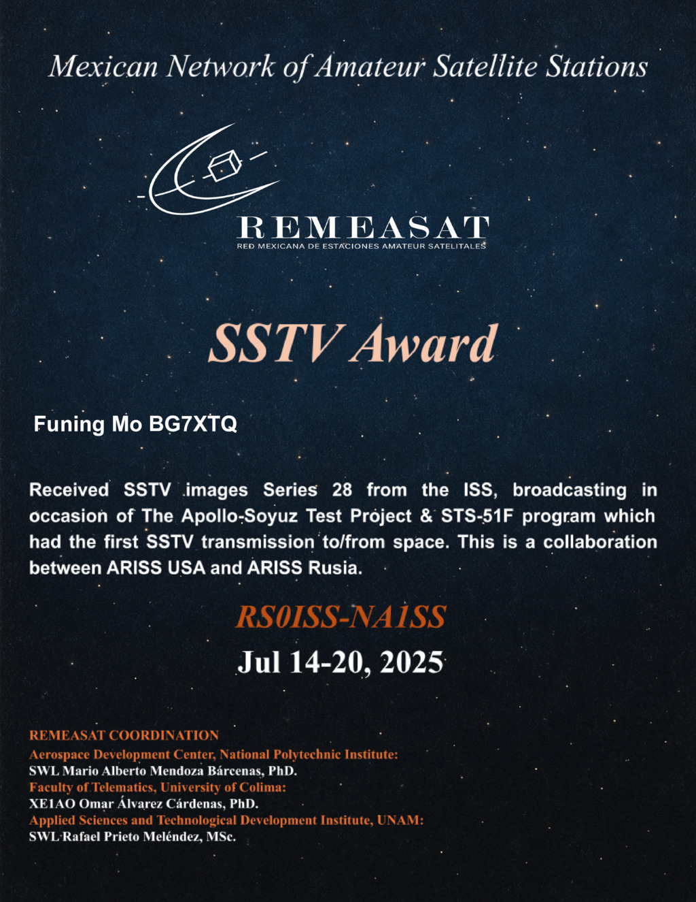

# 业余无线电电台 BG7XTQ 拿到的 QSL 卡片/证书

## QSL 卡片/证书目录

- [Texas Radio Shortwave (2025-07-04)](#texas-radio-shortwave-2025-07-04)
- [Texas Radio Shortwave (2025-06-06)](#texas-radio-shortwave-2025-06-06)
- [STARS (KUKAI daughter) (JR5YBO) (2025-05-25)](#stars-kukai-daughter-jr5ybo-2025-05-25)
- [TechnoSat (DP0TBA) (2025-05-24)](#technosat-dp0tba-2025-05-24)
- [TIGRISAT (HNATIG) (2025-05-23)](#tigrisat-hnatig-2025-05-23)
- [ENSO (ROBUSTA-1E) (FX6FRC) (2025-05-22)](#enso-robusta-1e-fx6frc-2025-05-22)
- [QUBE (DP2QU) (2025-05-20)](#qube-dp2qu-2025-05-20)
- [PEARL-1C (PEARLC) (2025-05-13)](#pearl-1c-pearlc-2025-05-13)
- [OTP-2 (2025-05-13)](#otp-2-2025-05-13)
- [ROBUSTA-3A (FX6FRD) (2025-05-13)](#robusta-3a-fx6frd-2025-05-13)
- [Diwata2 (PO-101) (2025-05-06)](#diwata-2-po-101-2025-05-06)
- [SamSat-Ionosphere (RS75S) (2025-05-11)](#samsat-ionosphere-rs75s-2025-05-11)
- [SONATE-2 (DP0SNX) (2025-04-19)](#sonate-2-dp0snx-2025-04-19)
- [SamSat-Ionosphere (RS75S) (2025-04-10)](#samsat-ionosphere-rs75s-2025-04-10)
- [CroCube (9A0CC) (2025-04-10)](#crocube-9a0cc-2025-04-10)
- [LASARsat (OK0LSR) (2025-04-08)](#lasarsat-ok0lsr-2025-04-08)
- [ArcticSat-1 (RS74S) (2025-04-01)](#arcticsat-1-rs74s-2025-04-01)
- [YOMOGI (JS1YMX) (2025-03-25)](#yomogi-js1ymx-2025-03-25)
- [NHK World-Japan (2025-03-11)](#nhk-world-japan-2025-03-11)
- [NHK World-Japan (2025-03-02)](#nhk-world-japan-2025-03-02)
- [UMKA-1 (RS40S) (2025-03-01)](#umka-1-rs40s-2025-03-01)
- [ReshUCube-2 (RS37S) (2025-01-28)](#reshucube-2-rs37s-2025-01-28)
- [HyperView-1G (RS66S) (2025-01-05)](#hyperview-1g-rs66s-2025-01-05)
- [ISS QSL Card from RS0ISS (2024-10-13)](#iss-qsl-card-from-rs0iss-2024-10-13)
- [SAKURA (JS1YNI) (2024-10-08)](#sakura-js1yni-2024-10-08)
- [ORBICRAFT-ZORKIY (RS15S) (2023-05-09)](#orbicraft-zorkiy-rs15s-2023-05-09)
- [2025-07-17 REMEASAT ARISS SSTV - July 14-20, 2025.](#remeasat-ariss-sstv-2025-07-17)
- [2025-07-15 Expedition 73 - ARISS Series 28 - Apollo Soyuz and STS-51F](#expedition-73-ariss-series-28-apollo-soyuz-and-sts-51f-2025-07-15)

---

**Texas Radio Shortwave (2025-07-04) - AM - Program: Music of Albert Collins (digital)**  
  

---

**Texas Radio Shortwave (2025-06-06) - AM - Program: Music of Kris Kristofferson (digital)**  
  

---

**STARS (KUKAI daughter) (JR5YBO) (2025-05-25) - CW (digital)**  
  

---

**TechnoSat (DP0TBA) (2025-05-24) - CW via NFM (digital)**  
  

---

**TIGRISAT (HNATIG) (2025-05-23) - FSK 9k6 -  (digital)**  
  

---

**ENSO (ROBUSTA-1E) (FX6FRC) (2025-05-22) - FSK 9k6 (digital)**  
  

---

**QUBE (DP2QU) (2025-05-20) - GFSK 9k6 (digital)**  
  

---

**珍珠號-1C PEARL-1C (PEARLC) (2025-05-13) - GMSK 9k6(!) (paper) [MHz: 435.310 (!)]**  
  

---

**OTP-2 (2025-05-13) - GFSK 4k8 (digital)**  
  

---

**ROBUSTA-3A (FX6FRD) (2025-05-13) - FSK 9k6 (digital)**  
  

---

**SamSat-Ionosphere (RS75S) (2025-05-11) - FSK 1k2 - Victory Day (digital)**  
  

---

**SONATE-2 (DP0SNX) (2025-04-19) - SSTV Martin M1 (digital)**  
  

---

**SamSat-Ionosphere (RS75S) (2025-04-10) - FSK 1k2 - Gagarin's Day (digital)**  
  

---

**CroCube (9A0CC) (2025-04-10) - GFSK 9k6 (digital)**  
  

---

**LASARsat (OK0LSR) (2025-04-08) - CW (digital)**  
  

---

**ArcticSat-1 (RS74S) (2025-04-01) - SSTV Robot36 - 1st of April Event (digital)**  
  

---

**YOMOGI (JS1YMX) (2025-03-25) - CW (digital)**  
  

---

**NHK World-Japan (2025-03-11) - AM (paper)**  
  

---

**NHK World-Japan (2025-03-02) - AM (paper)**  
  

---

**UMKA-1 (RS40S) (2025-03-01) GMSK USP 9k6 (digital)**  

---

**ReshUCube-2 (RS37S) (2025-01-28) - LoRa (digital)**  
  

---

**HyperView-1G (RS66S) (2025-01-05) - SSTV Robot72 (digital)**  
  

---

**Diwata-2 (PO-101) (2025-05-06) - FM - QSO as SWL (digital) [Time (UTC)(!): 6:05:00 PM]**  
  

---

**ISS QSL Card for SSTV reception from RS0ISS (2024-10-13)**  
  

---

**SAKURA (JS1YNI) (2024-10-08) - CW(!) (digital)**  
  

---

**ORBICRAFT-ZORKIY (RS15S) (2023-05-09) - SSTV Robot72 (digital)**  
  

## 确认图像接收的奖状和证书（主要为 SSTV 模式图像）

**2025-07-17 REMEASAT ARISS SSTV - July 14-20, 2025.(!)Typo: Russia**  

**2025-07-15 Expedition 73 - ARISS Series 28 - Apollo Soyuz and STS-51F**  

