# 📡 业余无线电台 BG7XTQ（前 JJ1DSB）的 QSL 卡和证书

## 📬 QSL 卡目录
<table>
<tr><td>

[SAQ (2025-10-24)](#saq-2025-10-24)  
[ASRTU-1 (2025-10-30)](#asrtu-1-2025-10-30)  
[CubeBel-2 (2025-10-10)](#cubebel-2-2025-10-10)  
[BOTAN (2025-10-10)](#botan-2025-10-10)  
[EIRSAT-1 (2025-09-03)](#eirsat-1-2025-09-03)  
[ITUpSat1 (2025-05-20)](#itupsat-1-2025-05-20)  
[SNUGLITE-I (2025-08-22)](#snuglite-i-2025-08-22)  
[UTMN-2 (2025-06-04)](#utmn-2-rs27s-2025-06-04)  
[RTI’s German service (2025-07-26)](#rti-s-german-service-2025-07-26)  
[NUSHSat-1 (2025-05-13)](#nushsat-1-2025-05-13)  
[Horizon (2025-08-10)](#horizon-rs59s-2025-08-10)  
[Nightjar (2025-07-17)](#nightjar-xx0uhf-2025-07-17)  

</td><td>

[STARS (2025-05-25)](#stars-kukai-daughter-jr5ybo-2025-05-25)  
[TechnoSat (2025-05-24)](#technosat-dp0tba-2025-05-24)  
[TIGRISAT (2025-05-23)](#tigrisat-hnatig-2025-05-23)  
[ROBUSTA-1E (2025-05-22)](#robusta-1e-enso-fx6frc-2025-05-22)  
[QUBE (2025-05-20)](#qube-dp2qu-2025-05-20)  
[PEARL-1C (2025-05-13)](#pearl-1c-2025-05-13)  
[OTP-2 (2025-05-13)](#otp-2-2025-05-13)  
[ROBUSTA-3A (2025-05-13)](#robusta-3a-fx6frd-2025-05-13)  
[Diwata-2 (2024-12-25)](#diwata-2-po-101-2024-12-25)  

</td><td>

[SamSat-Ionosphere (2025-05-11)](#samsat-ionosphere-rs75s-2025-05-11)  
[SONATE-2 (2025-02-16)](#sonate-2-dp0snx-2025-02-16)  
[SamSat-Ionosphere (2025-04-10)](#samsat-ionosphere-rs75s-2025-04-10)  
[CroCube (2025-04-10)](#crocube-9a0cc-2025-04-10)  
[LASARsat (2025-04-08)](#lasarsat-ok0lsr-2025-04-08)  
[ArcticSat-1 (2025-04-01)](#arcticsat-1-rs74s-2025-04-01)  
[YOMOGI (2024-12-10)](#yomogi-js1ymx-2024-12-10)  
[NHK World (2025-03-11)](#nhk-world-japan-2025-03-11)  
[NHK World (2025-03-02)](#nhk-world-japan-2025-03-02)  
[UmKA-1 (2025-03-01)](#umka-1-rs40s-2025-03-01)  
[UmKA-1 (2024-10-05)](#umka-1-rs40s-2024-10-05)  
[ReshUCube-2 (2025-01-28)](#reshucube-2-rs37s-2025-01-28)  
[HyperView-1G (2025-01-05)](#hyperview-1g-rs66s-2025-01-05)  
[ISS RS0ISS (2024-10-13)](#iss-qsl-card-from-rs0iss-2024-10-13)  
[SAKURA (2024-10-08)](#sakura-js1yni-2024-10-08)  
[OrbiCraft-Zorkiy (2023-05-09)](#orbicraft-zorkiy-rs15s-2023-05-09)

</td></tr></table>

## 📜 证书与奖项

- [2025-08-11~25 ENSO Contest #1 Diploma](#enso-contest-1-diploma)
- [RS15S (OrbiCraft-Zorkiy) (2025-04-07) Farewell Diploma](#orbicraft-zorkiy-diploma)
- [2025-10-03~09 Expedition 73 - ARISS Series 29 - World Space Week 2025](#expedition-73-ariss-series-29-world-space-week-2025-10-03)
- [2025-07-14~20 Expedition 73 - ARISS Series 28 - Apollo Soyuz and STS-51F](#expedition-73-ariss-series-28-apollo-soyuz-and-sts-51f-2025-07-14)
- [2025-07-14~20 Russia ISS SSTV Diploma](#russia-iss-sstv-diploma-2025-07-15)
- [2024-12-04 SSTV Diploma - Palace of Pioneers](#sstv-diploma-85th-anniversary-of-the-palace-of-pioneers-2024-12-04)
- [RS40S Special Event "Victory Day"](#rs40s-victory-day-2025-05-09)
- [RS40S School Space Telescope](#rs40s-school-space-telescope-2025-05-07)
- [RS40S Special Event "World Amateur Radio Day"](#rs40s-world-amateur-radio-day-2025-04-18)
- [RS40S Special Event "Cosmonautics Day"](#rs40s-cosmonautics-day-2025-04-12)
- [RS40S Special Event "April Fool's Day"](#rs40s-april-fool-s-day-2025-04-01)
- [RS40S Special Event "International Women's Day"](#rs40s-international-women-s-day-2025-03-08)
- [RS40S Special Event "Saudi Founding Day"](#rs40s-mayak-2025-02-22)
- [RS40S Special Event "MAYAK"](#rs40s-mayak-2025-02-01)

---

**SAQ (2025-10-24) - CW - UN-Day Oct 24th, 2025 Event (digital)**  

---

**ASRTU-1 (阿斯图友谊号) BJ1CR/RS64S (2025-10-30) - BPSK 9k6 - Image Data (digital)**  

---

**CubeBel-2 (2025-10-10) - GMSK 9k6 (digital)**  

---

**BOTAN (JS1YPT) (2025-10-10) - CW (digital)**  

---

**EIRSAT-1 (2025-09-03) - GMSK 9k6 (digital)**  
[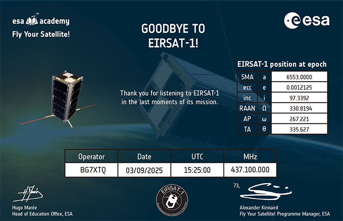](https://db.satnogs.org/satellite/58472)

---

**ITUpSat1 (2025-05-20) - CW (digital)**  

---

**SNUGLITE-I (2025-08-22) - GMSK 9k6 (digital)**  

---

**RS27S (UTMN-2, ТюмГУ) (2025-06-04) - GMSK USP 9k6 (digital)**  

---

**RTI’s German service (2025-07-26) - AM (paper)**  

---

**NUSHSat-1 (2025-05-13) - FSK 1k2 - Beacon (digital)**  

---

**Horizon (RS59S) (2025-08-10) - GMSK 9k6 - Image Data (digital)**  

---

**Nightjar (夜鷹號) (2025-07-17) - GFSK 4k8 (digital)**  

---

**STARS (KUKAI, 空海) JR5YBO (子) (2025-05-25) - CW (digital)**  

---

**TechnoSat (DP0TBA) (2025-05-24) - CW (digital)**  

---

**TIGRISAT (2025-05-23) - FSK 9k6 (digital)**  

---

**ROBUSTA-1E (ENSO, FX6FRC) (2025-05-22) - FSK 9k6 (digital)**  
[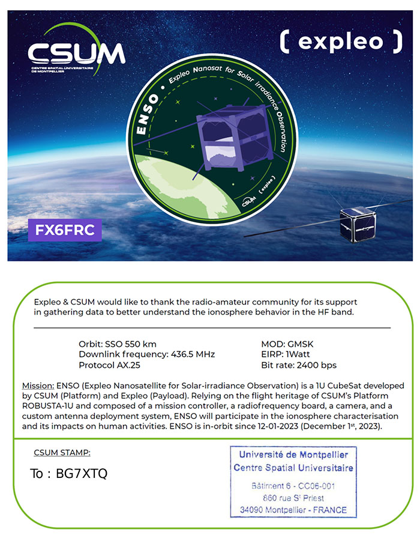](https://db.satnogs.org/satellite/58470)

---

**QUBE (DP2QU) (2025-05-20) - GFSK 9k6 (digital)**  
[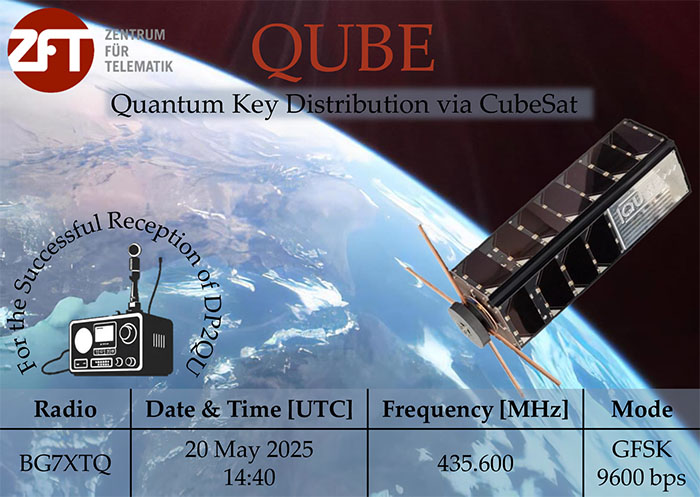](https://db.satnogs.org/satellite/60476)

---

**PEARL-1C (珍珠號-1C) (2025-05-13) - GMSK 9k6(!) (paper) [MHz: 435.310 (!)]**  

---

**OTP-2 (2025-05-13) - GFSK 4k8 (digital)**  

---

**ROBUSTA-3A (FX6FRD) (2025-05-13) - FSK 9k6 (digital)**  
[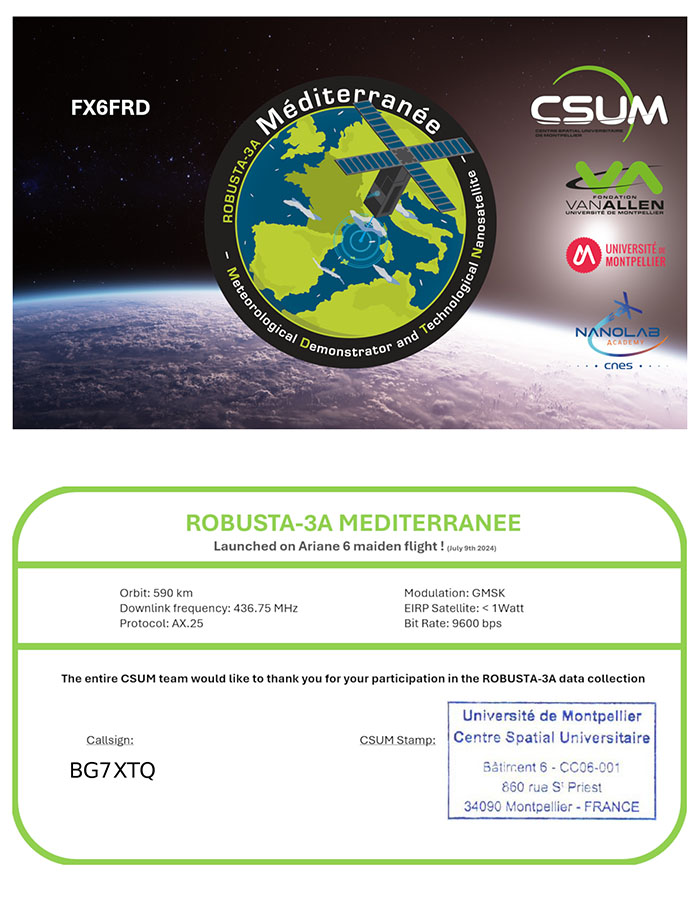](https://db.satnogs.org/satellite/60243)

---

**RS75S (SamSat-Ionosphere) (2025-05-11) - FSK 1k2 - Victory Day (digital)**  

---

**SONATE-2 (DP0SNX) (2025-02-16) - SSTV (digital)**  

---

**RS75S (SamSat-Ionosphere) (2025-04-10) - FSK 1k2 - Gagarin's Day (digital)**  

---

**CroCube (9A0CC) (2025-04-10) - GFSK 9k6 (digital)**  
[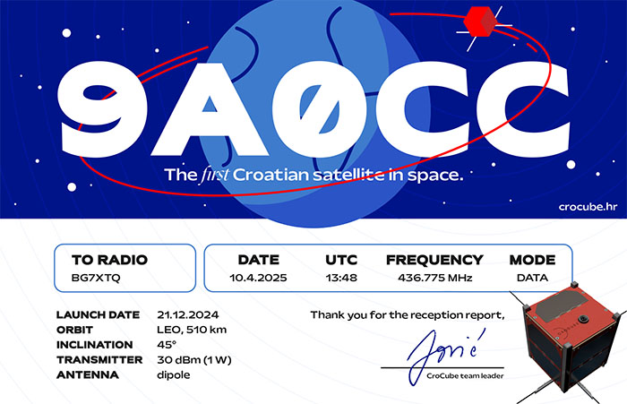](https://db.satnogs.org/satellite/62394)

---

**LASARsat (OK0LSR) (2025-04-08) - CW (digital)**  
[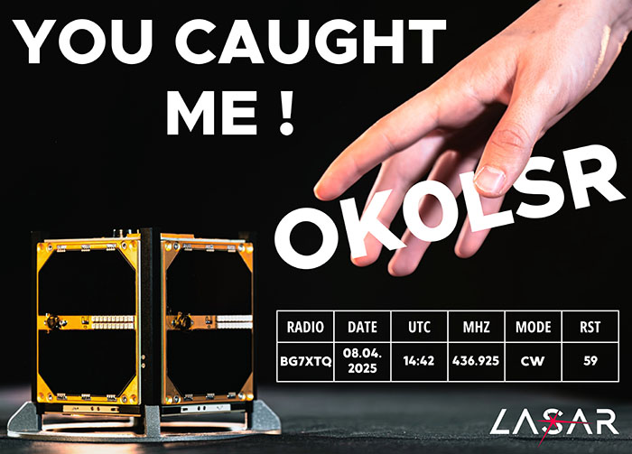](https://db.satnogs.org/satellite/62391)

---

**RS74S (Arcticsat-1) (2025-04-01) - SSTV Robot36 - 1st of April Event (digital)**  

---

**YOMOGI (JS1YMX) (2024-12-10) - CW (digital)**  

---

**NHK World-Japan (2025-03-11) - AM (paper)**  

---

**NHK World-Japan (2025-03-02) - AM (paper)**  

---

**RS40S (UmKA-1, УмКА-1) (2025-03-01) - GMSK USP 9k6 (digital)**  

---

**RS40S (UmKA-1, УмКА-1) (2024-10-05) - SSTV (digital)**  

---

**RS37S (ReshUCube-2) (2025-01-28) - LoRa (digital)**  
[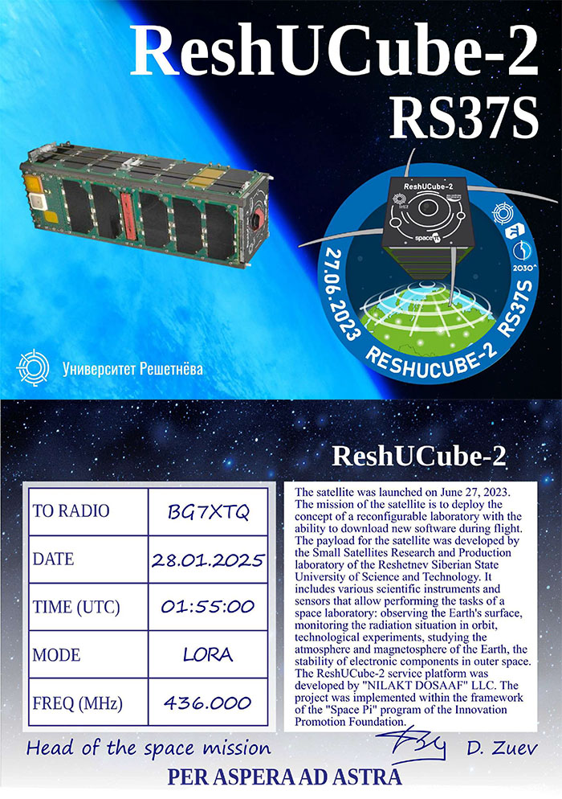](https://db.satnogs.org/satellite/57168)

---

**RS66S New Year's festive broadcast (2025-01-05)**  
[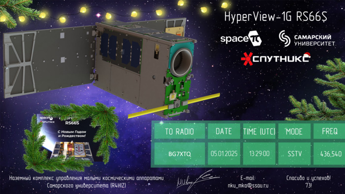](https://db.satnogs.org/satellite/61772)

---

**Diwata-2 (PO-101) (2024-12-25) - FM (digital)**  
(Philippine Space Agency confirmed my QSO with BG7QOA)  

---

**ISS QSL Card for SSTV reception from RS0ISS (2024-10-13)**  
[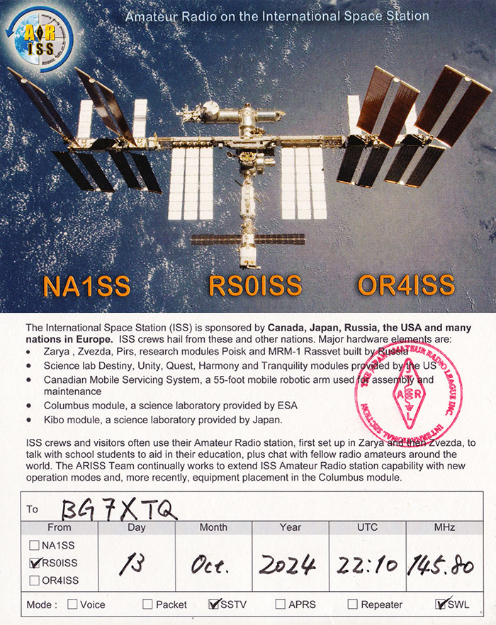](https://db.satnogs.org/satellite/25544)

---

**SAKURA (JS1YNI) (2024-10-08) - CW(!) (digital)**  
[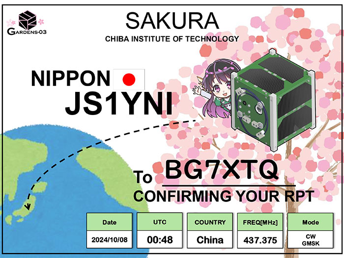](https://db.satnogs.org/satellite/60954)

---

**RS15S (OrbiCraft-Zorkiy) (2023-05-09) - SSTV (digital)**  

---

## 📜 确认图像接收的证书与奖项

**2025-08-11~25 ENSO Contest #1 Diploma**  

---

**RS15S (OrbiCraft-Zorkiy) (2025-04-07) Farewell Diploma**  

---

**2025-10-03~09 Expedition 73 - ARISS Series 29 - World Space Week 2025**  
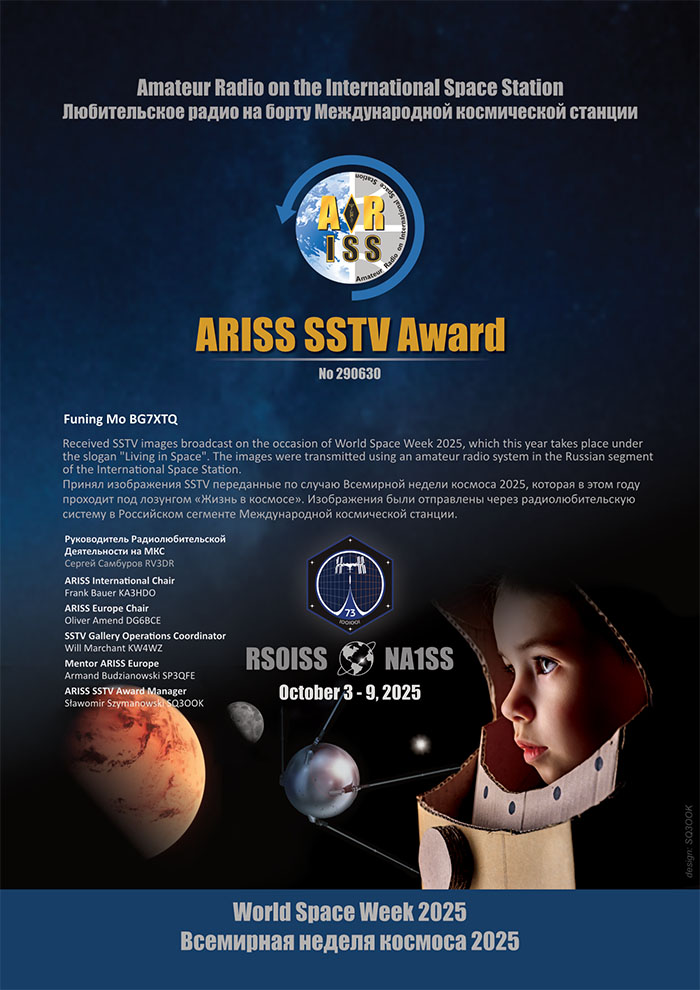

---

**2025-07-14~20 Expedition 73 - ARISS Series 28 - Apollo Soyuz and STS-51F - ARISS SSTV Award**  

---

**2025-07-14~20 Russia ISS SSTV Diploma**  
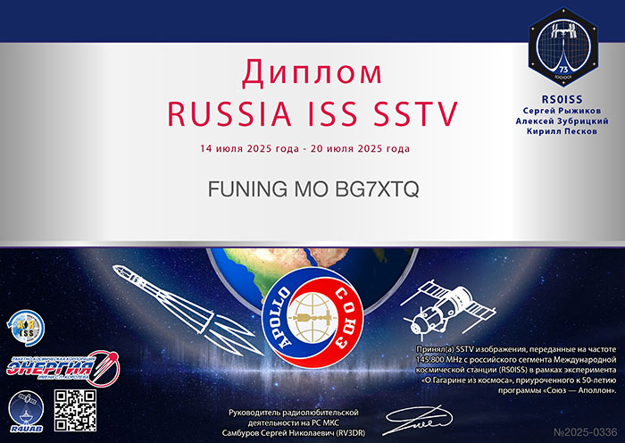

---

**SSTV diploma - 85th anniversary of the Palace of Pioneers (2024-12-04) [via RS40S]**  
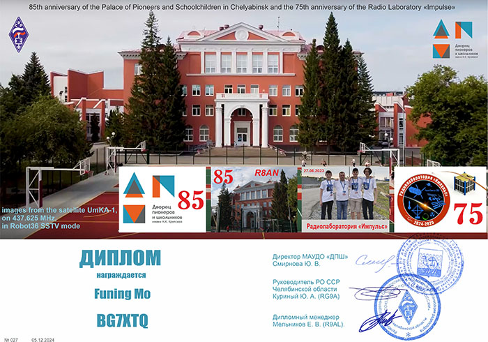

---

**RS40S Special Event "Victory Day" (2025-05-09) - SSTV (digital)**  

---

**RS40S School Space Telescope (2025-05-07) - SSTV (digital)**  

---

**RS40S Special Event "World Amateur Radio Day" (2025-04-18) - SSTV (digital)**  

---

**RS40S Special Event "Cosmonautics Day" (2025-04-12) - SSTV (digital)**  

---

**RS40S Special Event "April Fool's Day" (2025-04-01) - SSTV (digital)**  
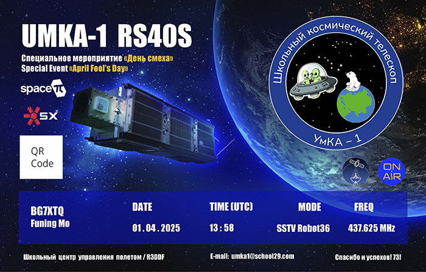

---

**RS40S Special Event "International Women's Day" (2025-03-08) - SSTV (digital)**  

---

**RS40S Special Event "Saudi Founding Day" (2025-02-22) - SSTV (digital)**  

---

**RS40S Special Event "MAYAK" (2025-02-01) - SSTV (digital)**  

---
