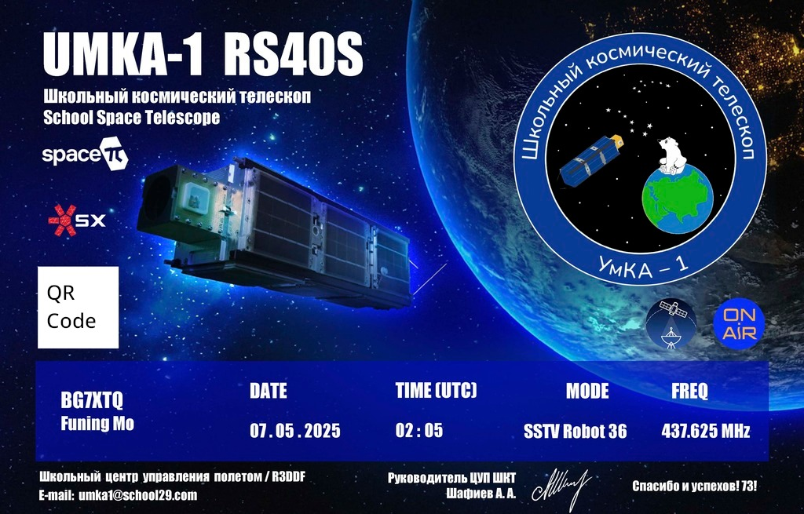
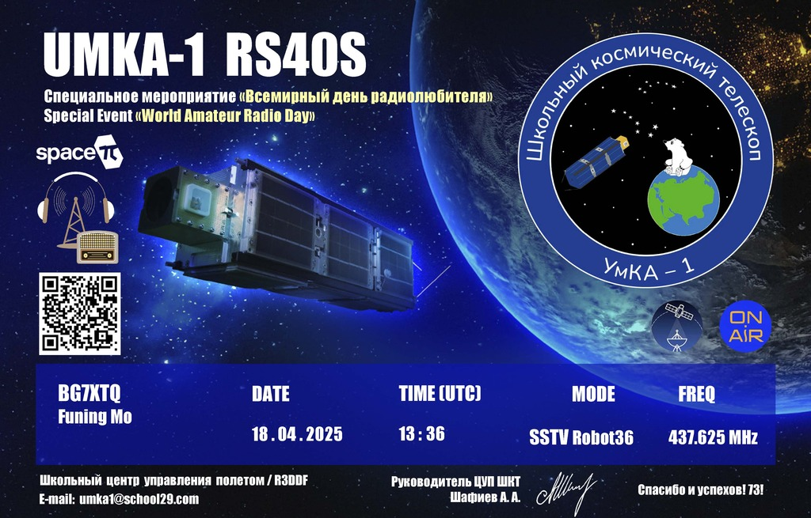
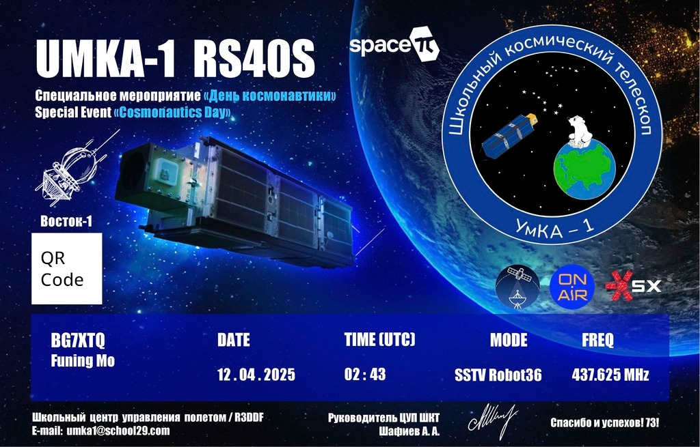
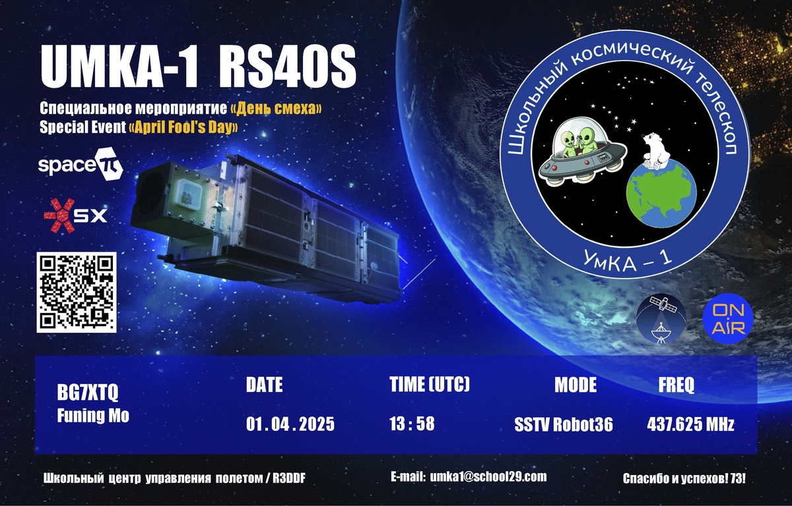
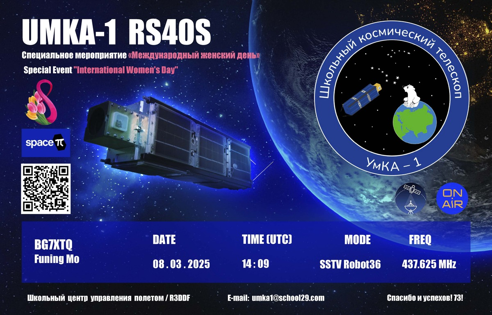
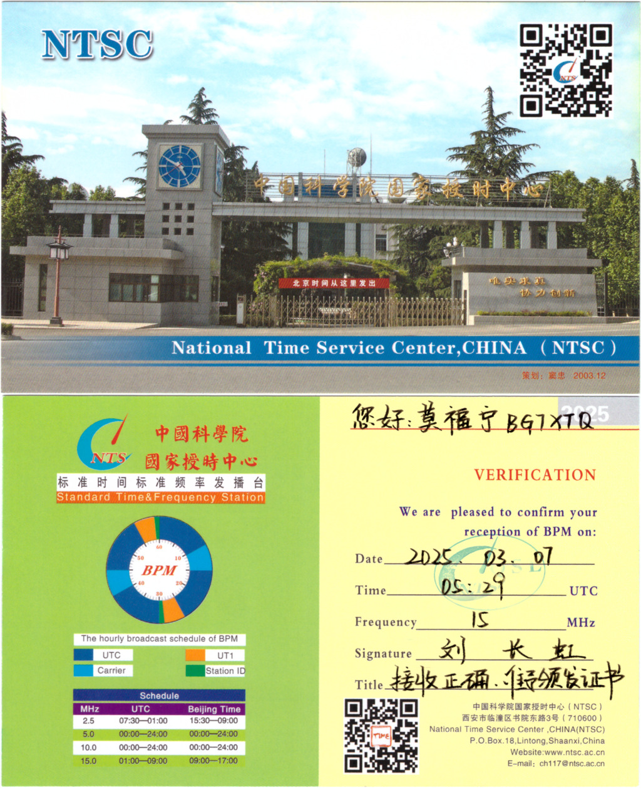
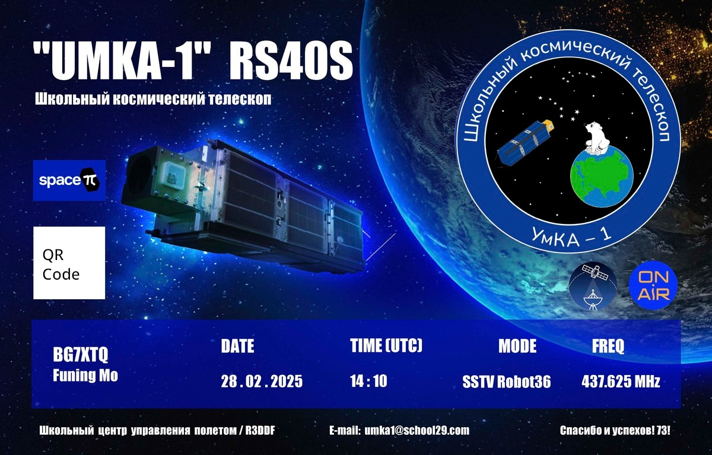
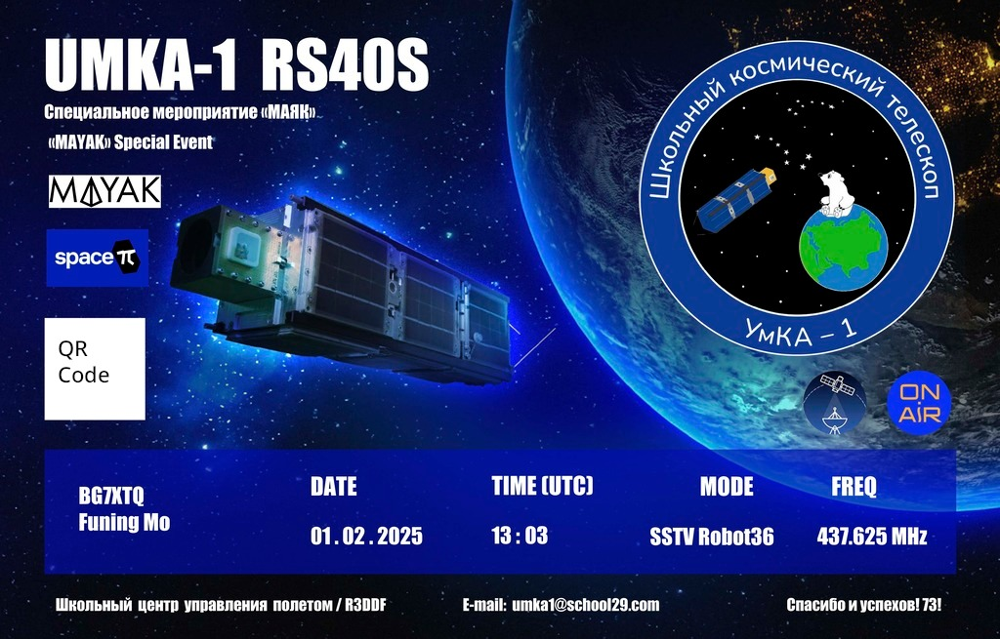
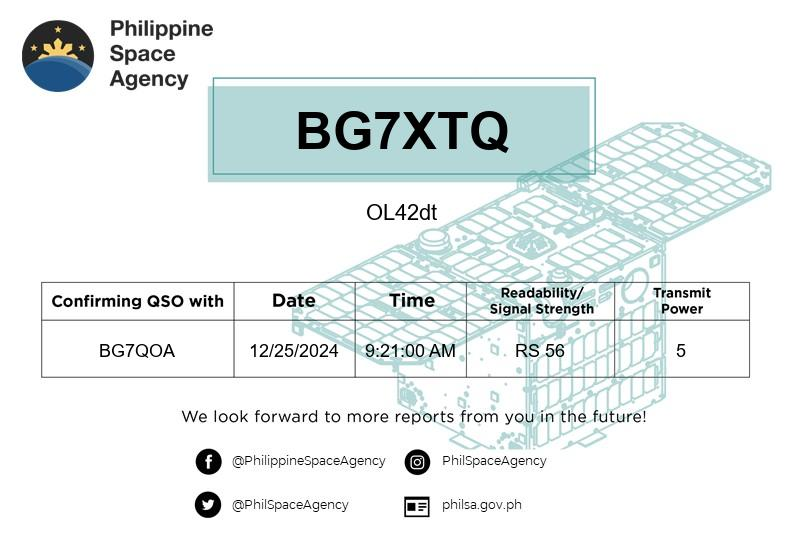
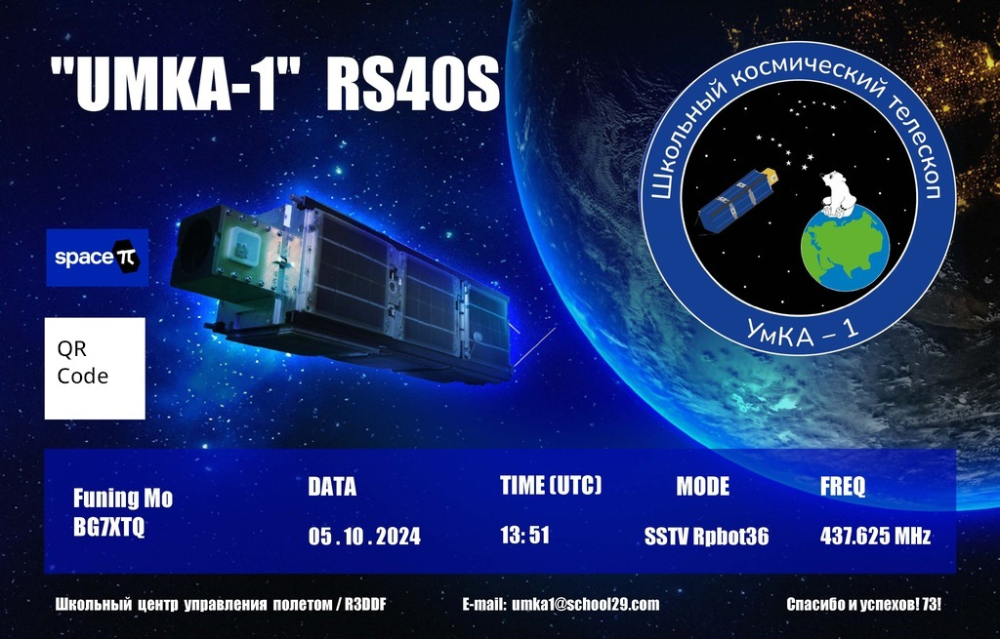

# 业余无线电电台 BG7XTQ 拿到的 QSL 卡片

## QSL 卡片目录（从新到旧排列）

- [UMKA-1 (RS40S) (2025-05-07)](#umka-1-rs40s-2025-05-07)
- [UMKA-1 (RS40S) (2025-04-18)](#umka-1-rs40s-2025-04-18)
- [UMKA-1 (RS40S) (2025-04-12)](#umka-1-rs40s-2025-04-12)
- [UMKA-1 (RS40S) (2025-04-01)](#umka-1-rs40s-2025-04-01)
- [UMKA-1 (RS40S) (2025-03-08)](#umka-1-rs40s-2025-03-08)
- [BPM (2025-03-07)](#bpm-2025-03-07)
- [UMKA-1 (RS40S) (2025-03-01)](#umka-1-rs40s-2025-03-01)
- [UMKA-1 (RS40S) (2025-02-28)](#umka-1-rs40s-2025-02-28)
- [XSG (2025-02-13)](#xsg-2025-02-13)
- [UMKA-1 (RS40S) (2025-02-01)](#umka-1-rs40s-2025-02-01)
- [Diwata-2 (PO-101) (2024-12-25)](#diwata-2-po-101-2024-12-25)
- [UMKA-1 (RS40S) (2024-10-05)](#umka-1-rs40s-2024-10-05)

---

**UMKA-1 (RS40S) (2025-05-07) - SSTV Robot36 - School Space Telescope (digital) [Frequency: 435.825 (!)]**  

---

**UMKA-1 (RS40S) (2025-04-18) - SSTV Robot36 - Special Event "World Amateur Radio Day" (digital)**

---

**UMKA-1 (RS40S) (2025-04-12) - SSTV Robot36 - Special Event "Cosmonautics Day" (digital)**

---

**UMKA-1 (RS40S) (2025-04-01) - SSTV Robot36 - Special Event "April Fool's Day" (digital)**

---

**UMKA-1 (RS40S) (2025-03-08) - SSTV Robot36 - Special Event "International Women's Day" (digital)**

---

**BPM (2025-03-07) 15MHz - AM (paper)**  

---

**UMKA-1 (RS40S) (2025-03-01) GMSK USP 9k6 (digital)**  

---

**UMKA-1 (RS40S) (2025-02-28) SSTV Robot36 (digital)**  

---

**XSG (2025-02-13) - CW - Special Event "120 Years of XSG: Special World Radio Day" (paper)**  

---

**UMKA-1 (RS40S) (2025-02-01) - SSTV Robot36 - Special Event "MAYAK" (digital)**  

---

**Diwata-2 (PO-101) (2024-12-25) - FM - QSO with BG7QOA (digital)**  

---

**UMKA-1 (RS40S) (2024-10-05) SSTV Robot36 (digital)**  

