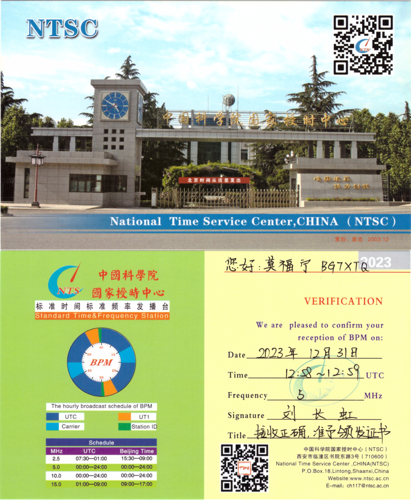
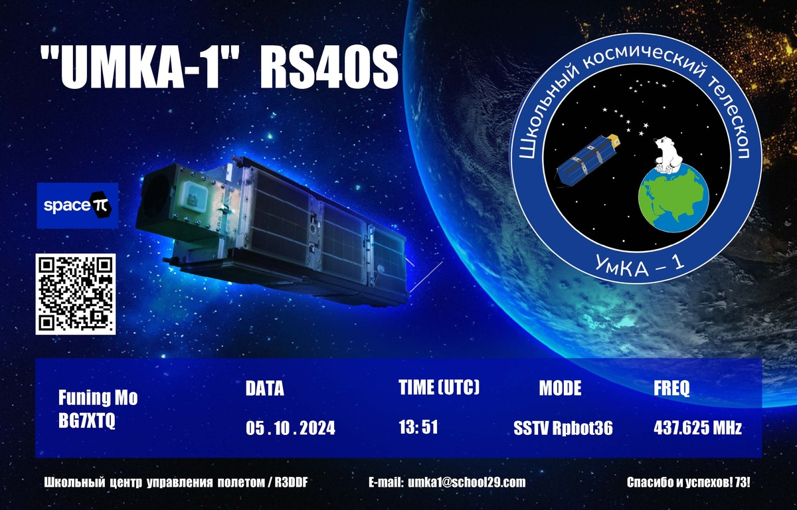
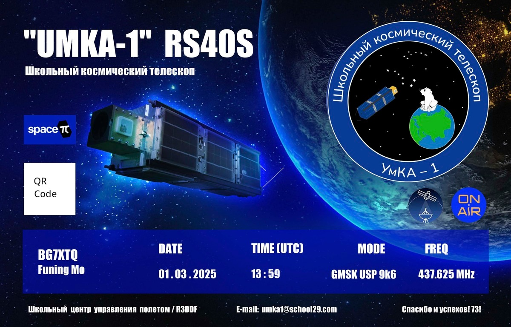
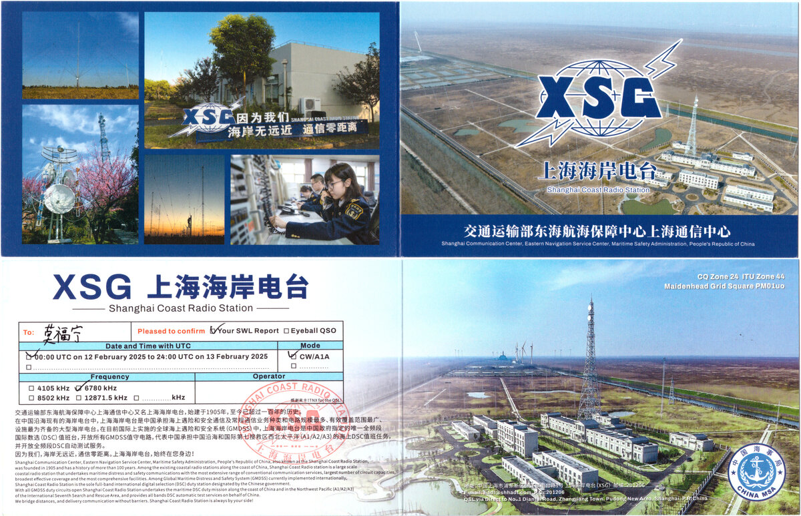
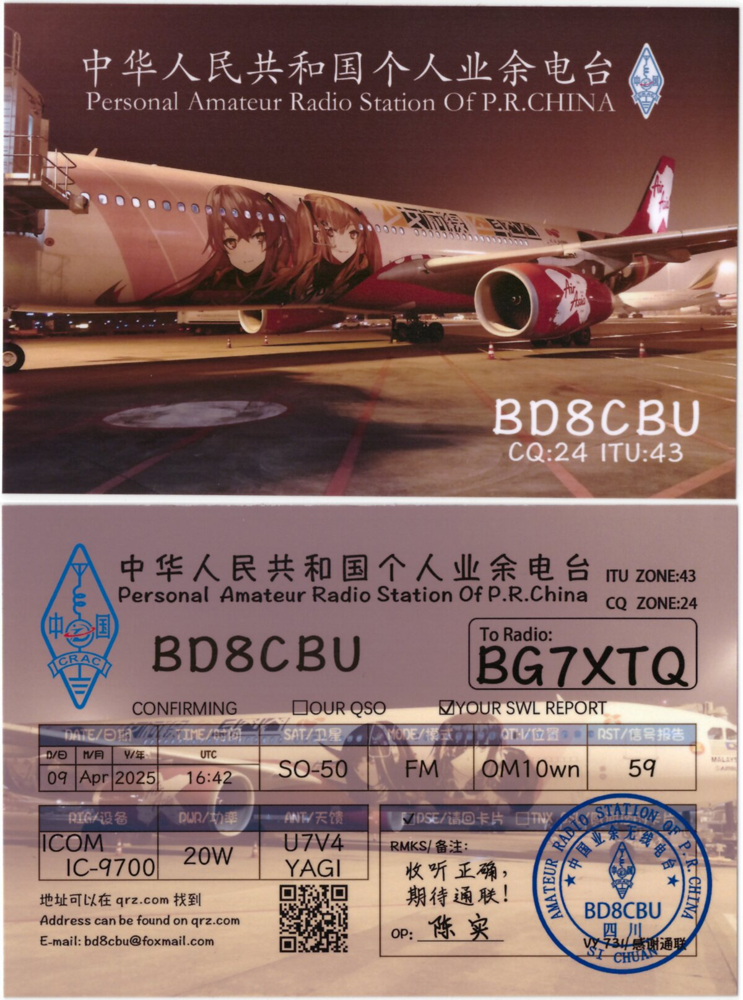

# 我收集的业余无线电 QSL / SWL 卡片

**BPM (2023-12-31) 5MHz - AM CW (paper)**  

---

**UMKA-1 (RS40S) (2024-10-05) SSTV Robot36 (digital)**  

---

**UMKA-1 (RS40S) (2025-03-01) GMSK USP 9k6 (digital)**  

---

**XSG (2025-02-13) - AM CW (paper)**  

---

**BD8CBU (2025-04-09) - FM via SO-50 sat. (paper)**  

