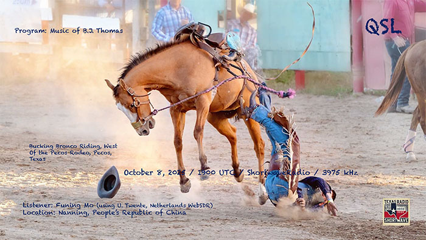
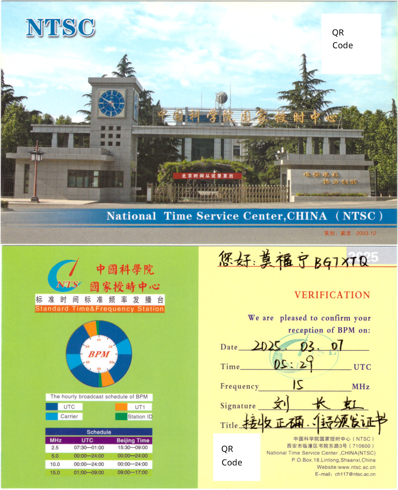

# 📡 业余无线电台 BG7XTQ（前 JJ1DSB）的 QSL 卡

## 📬 QSL 卡

**Diwata-2 (PO-101) (2024-11-25) - FM (digital)**  
(Philippine Space Agency confirmed my QSO with BG7QOA)  

---

**Texas Radio Shortwave (2025-10-31) - AM - Program: 2025 Texas Halloween Music (digital)**

---

**Texas Radio Shortwave (2025-10-08) - AM - Program: Music of B.J. Thomas (digital)**

---

**Texas Radio Shortwave (2025-08-03) - AM - Program: Music of Bobby Fuller Four (digital)**

---

**Texas Radio Shortwave (2025-07-04) - AM - Program: Music of Albert Collins (digital)**  
  

---

**SAQ 100 Year Anniversary Transmissions (2025-07-02) - CW (digital)**

---

**Texas Radio Shortwave (2025-06-06) - AM - Program: Music of Kris Kristofferson (digital)**  
  

---

**My QSO with BG5FPK (2025-08-02) (paper)**  

---

**BPM (2025-03-07) 15MHz - AM (paper)**  

---

**XSG (2025-02-13) - CW - Special Event "120 Years of XSG: Special World Radio Day" (paper)**  

---

**Diwata-2 (PO-101) (2025-05-06) - QSO as SWL (digital) [Time (UTC): 06:05(!)]**  

---

**Diwata-2 (PO-101) (2024-11-18) - QSO as SWL (digital)**  

---

## 📜 确认图像接收的证书与奖项

**2025-08-11 FRC Buenaventura SSTV Diploma ARCTICSAT-1**

---

**2025-08-09~10 FRC Buenaventura SSTV Diploma UMKA-1**

---

**2025-07-14~20 FRC ISSTV-SSP diploma**

---

**2025-10-03~06 REMEASAT ARISS SSTV Award**  

---

**2025-07-14~20 REMEASAT ARISS SSTV Award(!)Typo: Russia**  

---